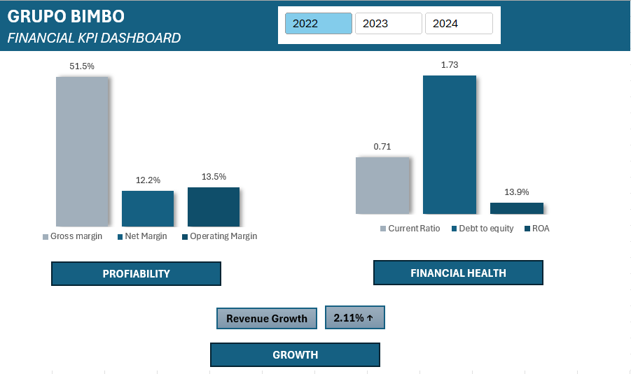

# Financial Analysis Project – Grupo Bimbo
## Overview
This project analyzes the financial performance of Grupo Bimbo using real financial data, including the development of financial statements and key ratio analysis.

## Dashboard Preview

## Key Insights
- Revenue growth reflects business expansion over time.
- Profitability ratios indicate overall financial health.
- Liquidity and leverage ratios highlight the company’s financial stability.
- Financial trends support strategic decision-making.

## Files
- Financial_analysis_bimbo.xlsx
- Financial_analysis_bimbo_Report.pdf
